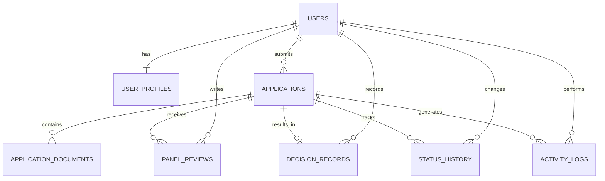

# FSMES Database Specifications

## 1. Appwrite Platform Boundary
### Core Platform
- Authentication: Appwrite Auth (`Users` + session/JWT flows)
- Database: Appwrite `TablesDB` (preferred for new implementation)
- File Storage: Appwrite Storage (for uploaded scholarship requirements)

### Implementation Rule
- Use `TablesDB` for all new schema and row operations.
- Use legacy `Databases` API only if migrating from an existing legacy Appwrite project.

## 2. Appwrite MCP API Enablement
Use these MCP startup flags to enable Appwrite APIs:

| Flag | Purpose | FSMES Use |
| --- | --- | --- |
| `--tablesdb` | Enables TablesDB API | Required |
| `--users` | Enables Users API | Required |
| `--storage` | Enables Storage API | Required |
| `--teams` | Enables Teams API | Optional |
| `--functions` | Enables Functions API | Optional (for backend automations) |
| `--messaging` | Enables Messaging API | Optional |
| `--locale` | Enables Locale API | Optional |
| `--avatars` | Enables Avatars API | Optional |
| `--databases` | Enables legacy Databases API | Optional, migration only |
| `--all` | Enables all Appwrite APIs | Allowed for full-access dev environments |

### Recommended MCP Launch Profile (FSMES)
- Minimum: `--tablesdb --users --storage`
- Extended: `--tablesdb --users --storage --functions`
- Full dev mode: `--all`

## 3. Data Model (FSMES)
### System Actor Constraint
Only two in-app actors are valid for FSMES:
- `faculty_applicant`
- `panelist_checker`

### Core Entities
- Users
- User Profiles
- Applications
- Application Documents
- Panel Reviews
- Decision Records
- Status History
- Activity Logs

### Entity Notes
- `Users`: authenticated account identity.
- `User Profiles`: role, organization, and display metadata.
- `Applications`: scholarship submission record.
- `Application Documents`: uploaded supporting files and versions.
- `Panel Reviews`: completeness checks and review notes.
- `Decision Records`: panel outcomes for the scoped IASP stage.
- `Status History`: transition log (`from_status`, `to_status`, actor, reason, time).
- `Activity Logs`: key audit-friendly actions.

## 4. Logical ERD


## 5. Suggested TablesDB Tables
- `user_profiles`
- `applications`
- `application_documents`
- `panel_reviews`
- `decision_records`
- `status_history`
- `activity_logs`

## 6. Table Column Guidance (Appwrite Skill-Aligned)
### `user_profiles`
- `user_id` (`varchar`, required, indexed, unique)
- `full_name` (`varchar`, required)
- `role` (`varchar`, required, enum: `faculty_applicant` | `panelist_checker`)
- `department` (`varchar`, optional)
- `college_or_office` (`varchar`, optional)
- `employee_no` (`varchar`, optional)
- `phone` (`varchar`, optional)

### `applications`
- `applicant_id` (`varchar`, required, indexed)
- `reference_no` (`varchar`, required, unique)
- `academic_year` (`varchar`, required)
- `semester` (`varchar`, required)
- `scholarship_type` (`varchar`, required)
- `proposed_program` (`varchar`, optional)
- `institution_name` (`varchar`, optional)
- `purpose_statement` (`text`, required)
- `current_status` (`varchar`, required, indexed)
- `submitted_at` (`datetime`, optional)

### `application_documents`
- `application_id` (`varchar`, required, indexed)
- `uploaded_by` (`varchar`, required)
- `requirement_code` (`varchar`, required)
- `requirement_name` (`varchar`, required)
- `file_id` (`varchar`, required)
- `file_name` (`varchar`, required)
- `mime_type` (`varchar`, required)
- `file_size` (`integer`, required)
- `version_no` (`integer`, required)
- `is_current` (`boolean`, required)
- `uploaded_at` (`datetime`, required)

### `panel_reviews`
- `application_id` (`varchar`, required, indexed)
- `reviewer_id` (`varchar`, required)
- `review_status` (`varchar`, required)
- `review_notes` (`text`, optional)
- `missing_items` (`text`, optional)
- `reviewed_at` (`datetime`, required)

### `decision_records`
- `application_id` (`varchar`, required, unique)
- `decided_by` (`varchar`, required)
- `panel_outcome` (`varchar`, required, indexed)
- `decision_notes` (`text`, optional)
- `decided_at` (`datetime`, required)

### `status_history`
- `application_id` (`varchar`, required, indexed)
- `changed_by` (`varchar`, required)
- `from_status` (`varchar`, required)
- `to_status` (`varchar`, required, indexed)
- `reason` (`text`, optional)
- `changed_at` (`datetime`, required)

### `activity_logs`
- `application_id` (`varchar`, optional, indexed)
- `actor_id` (`varchar`, required, indexed)
- `action_type` (`varchar`, required, indexed)
- `action_summary` (`text`, optional)
- `created_at` (`datetime`, required)

## 7. Index and Integrity Rules
- Add indexes for queue-critical filters: `current_status`, `applicant_id`, `panel_outcome`, `changed_at`.
- Enforce one current decision row per application (`decision_records.application_id` unique).
- Enforce only one active document version per (`application_id`, `requirement_code`).
- Prevent invalid status transitions in backend logic (Hono/Functions), then append `status_history`.

## 8. Canonical Workflow Enums (From PRD)
### Application Statuses
- `Draft`
- `Submitted`
- `Under Review`
- `Returned for Revision`
- `Resubmitted`
- `Decision Recorded`
- `Closed`

### Panel Outcome Values
- `Recommended`
- `Not Recommended`
- `Returned for Revision`

Note: `Recommended` is not equivalent to final APDP approval. It is only the panel-side outcome within the scoped IASP workflow.

## 9. Storage Mapping
- Storage bucket: `application_documents`
- Store file metadata in `application_documents` table (`file_id`, `file_name`, `mime_type`, `file_size`).
- Keep file access role-bound: applicants to own files, panel to submitted cases.

## 10. Appwrite SDK Pattern (TypeScript)
```ts
import { Client, TablesDB, Storage, Users, ID } from 'node-appwrite'

const client = new Client()
  .setEndpoint(process.env.APPWRITE_ENDPOINT!)
  .setProject(process.env.APPWRITE_PROJECT_ID!)
  .setKey(process.env.APPWRITE_API_KEY!)

const tablesDB = new TablesDB(client)
const storage = new Storage(client)
const users = new Users(client)

await tablesDB.createRow({
  databaseId: process.env.APPWRITE_DATABASE_ID!,
  tableId: 'applications',
  rowId: ID.unique(),
  data: {
    applicant_id: 'user_123',
    reference_no: 'FSMES-2026-0001',
    academic_year: '2026-2027',
    semester: '1st',
    scholarship_type: 'Faculty Scholarship',
    purpose_statement: 'Sample',
    current_status: 'Draft'
  }
})
```

## 11. Delivery Alignment
Before implementation starts, confirm:
- final table columns and required constraints
- final status and panel outcome enums (must match PRD exactly)
- final Appwrite bucket permissions
- final API enablement flags for MCP (`--tablesdb --users --storage` minimum)

## 12. PRD-Linked Audit Events
`activity_logs.action_type` should, at minimum, cover PRD-required audit-friendly events:
- `submission`
- `document_upload`
- `return_for_revision`
- `resubmission`
- `decision_recording`

## 13. MCP Scope Notes
- Appwrite MCP calls still depend on project/service scopes even when APIs are enabled.
- If an endpoint returns scope errors (for example: missing `public` scope), update MCP credentials/role scopes in Appwrite before retrying.
