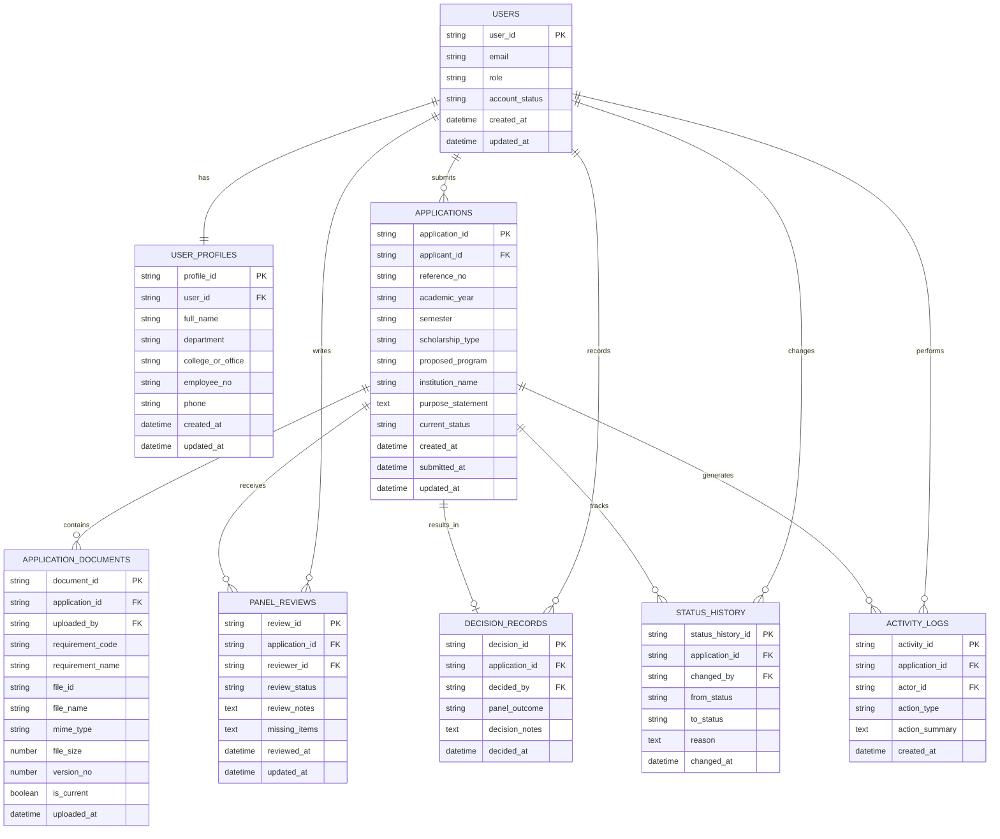

# Faculty Scholarship Grant Management and Evaluation System (FSMES) PRD

Version: 1.0  
Document Type: Product Requirements Document  
Audience: Designers, frontend developers, backend developers, QA, capstone team  
Product Stage: Internal prototype / MVP  
Primary Platform: Responsive web application

## 1. Product Summary
FSMES is a web-based workflow system for the application submission and panel evaluation stages of faculty scholarship processing under the Institute Academic Scholarship Panel (IASP) scope of the Academic Personnel Development Program (APDP) at MSU-IIT.

The product replaces fragmented manual handling across paper files, email, and ad hoc follow-up with a centralized, role-bounded, traceable workflow. It is intentionally scoped to two primary user groups:
- Faculty Applicant
- Academic Scholarship Panel Member

FSMES does not automate the full APDP chain beyond the IASP stage.

## 2. Problem Statement
The current faculty scholarship workflow suffers from:
- manual and fragmented document handling
- limited visibility into application status
- weak traceability of workflow actions
- repetitive follow-up between stakeholders
- difficulty organizing submissions and evaluation records in one authoritative place

General-purpose tools can store files or messages, but they do not enforce role-sensitive actions, stage-based flow, or centralized status tracking for the IASP submission and panel evaluation process.

## 3. Product Vision
Create a focused, reliable, and easy-to-use digital platform that helps faculty applicants submit scholarship requirements and helps the Academic Scholarship Panel review, organize, and record decisions within a structured workflow.

## 4. Product Goals
### Primary Goals
- Digitize the application submission and panel evaluation stages of the IASP workflow.
- Centralize application records and supporting documents in one system.
- Provide applicants with clear status visibility.
- Provide panel users with a review workspace that supports organization, traceability, and decision recording.
- Enforce role-based access and stage-based workflow behavior.

### Success Indicators
- Applicants can complete end-to-end submission without relying on paper or scattered channels.
- Panel users can review applications and record outcomes from a centralized interface.
- Every application has a visible status trail and decision history.
- Core test cases pass without workflow-blocking defects.
- Usability feedback indicates that users understand and can navigate the workflow prototype.

## 5. Product Scope
### In Scope
- account sign-in and role-based access
- faculty applicant profile and application submission
- supporting document upload and management
- applicant-side status tracking
- panel-side application queue and review workspace
- panel review notes, completeness checks, and decision recording
- workflow-sensitive status updates
- centralized records and audit-friendly activity history

### Out of Scope
- Department Chairperson endorsement routing
- College Dean endorsement routing
- Academic Planning Committee workflow
- Chancellor Special Order generation
- Board of Regents confirmation workflow
- post-award compliance document handling
- stipend, finance, or disbursement processing
- university-wide deployment administration portal
- public scholarship discovery portal

## 6. Users and Roles
### 6.1 Faculty Applicant
A faculty member who prepares, submits, updates, and monitors a scholarship application within the scoped workflow.

Primary needs:
- create and complete an application
- upload required supporting documents
- submit without ambiguity
- monitor status and panel feedback
- respond to revision requests if returned

### 6.2 Academic Scholarship Panel Member
A panel-side evaluator who receives, reviews, organizes, and records action on submitted applications.

Primary needs:
- view submitted applications in one queue
- review application details and supporting documents
- check completeness and add notes
- return incomplete cases for revision
- record panel-level outcomes
- maintain traceability of actions taken

### 6.3 Roles Explicitly Not Implemented In-App
The following are process stakeholders but are not primary in-app user roles in the scoped MVP:
- OVCAA staff
- Department Chairperson
- College Dean
- Academic Planning Committee members
- Chancellor office users
- Board of Regents users

## 7. Product Principles
- Workflow clarity over feature bloat
- Status visibility over informal follow-up
- Role separation over shared access
- Traceability over hidden actions
- Institutional professionalism over consumer-style decoration
- Scope discipline over APDP-wide overreach

## 8. System-Enforced Rules vs Human-Reviewed Rules
### System-Enforced Rules
FSMES must enforce:
- sign-in before access
- role-based feature and data access
- required fields before final submission
- required document slots before final submission
- allowed status transitions
- applicant ownership of editable drafts and returned applications only
- immutable timestamps for key workflow events
- decision and status history recording

### Human-Reviewed Rules
FSMES must not pretend to automate judgment that still belongs to people. The following remain human-reviewed:
- actual eligibility under APDP policy
- authenticity and correctness of submitted documents
- substantive merit of the application
- final panel recommendation quality
- later endorsement and approval steps outside the scoped workflow

## 9. Core Workflow
### Applicant Flow
1. Sign in.
2. View dashboard and current application state.
3. Create a new application draft.
4. Complete form fields and upload supporting documents.
5. Save draft as needed.
6. Submit once all required fields and documents are complete.
7. Monitor status updates.
8. If returned for revision, update content and resubmit.
9. View final panel-level outcome recorded within the scoped stage.

### Panel Flow
1. Sign in.
2. View dashboard and review queue.
3. Open a submitted application.
4. Review application details and uploaded documents.
5. Record completeness findings and review notes.
6. Return for revision or record a panel-level outcome.
7. Update status and preserve history.
8. Continue managing pending and completed cases.

## 10. Status Model
### Application Statuses
- Draft
- Submitted
- Under Review
- Returned for Revision
- Resubmitted
- Decision Recorded
- Closed

### Panel Outcome Values
Because the system is limited to the IASP stage, panel outcomes should remain stage-bounded. Recommended values:
- Recommended
- Not Recommended
- Returned for Revision

Note: `Recommended` is not equivalent to final APDP approval. It is only the panel-side outcome within the scoped workflow.

## 11. Permissions Matrix
| Action | Faculty Applicant | Academic Scholarship Panel Member |
| --- | --- | --- |
| Sign in and sign out | Yes | Yes |
| View own profile | Yes | Yes |
| Edit own profile | Yes | Yes |
| Create application draft | Yes | No |
| Edit draft before submission | Yes | No |
| Upload and replace own documents before submission | Yes | No |
| Submit application | Yes | No |
| View own application status and history | Yes | No |
| View other users' applications | No | Yes |
| View submitted documents for review | No | Yes |
| Add review notes | No | Yes |
| Return application for revision | No | Yes |
| Record panel outcome | No | Yes |
| Update workflow status within panel stage | No | Yes |
| Search and filter application queue | No | Yes |
| View audit trail for reviewed applications | No | Yes |

## 12. Functional Requirements
| ID | Requirement | Priority | Acceptance Criteria |
| --- | --- | --- | --- |
| FR-01 | The system shall support secure sign-in and sign-out for registered users. | Must | Users must authenticate before accessing protected pages; sessions must end on sign-out. |
| FR-02 | The system shall route users to role-appropriate dashboards after sign-in. | Must | Applicants land on the applicant dashboard; panel users land on the panel dashboard. |
| FR-03 | The system shall store a basic user profile for each authenticated user. | Must | Profile includes name, role, department or office context, and contact details as configured for the prototype. |
| FR-04 | The system shall allow a faculty applicant to create and save an application draft. | Must | Applicant can start a draft, save partial data, return later, and view the draft in their application list. |
| FR-05 | The system shall allow a faculty applicant to edit only their own draft or returned application. | Must | Applicant cannot edit other users' applications; submitted applications are locked unless returned for revision. |
| FR-06 | The system shall support uploading, replacing, and viewing supporting documents tied to an application. | Must | Documents are associated with the correct application; current file version is visible; upload errors are surfaced clearly. |
| FR-07 | The system shall validate required fields and required document slots before final submission. | Must | Final submit is blocked until required information is complete; validation messages identify what is missing. |
| FR-08 | The system shall create a submission record with a timestamp when an applicant submits an application. | Must | Submitted application receives a status, submission timestamp, and reference identifier. |
| FR-09 | The system shall allow applicants to view the current status and history of their own application. | Must | Applicant can see current state, key timestamps, and revision or outcome notes relevant to them. |
| FR-10 | The system shall provide panel users with a queue of submitted and in-progress applications. | Must | Queue supports list view, sorting, filtering by status, and opening a detailed review page. |
| FR-11 | The system shall provide panel users with a review workspace for each application. | Must | Workspace shows applicant details, submitted data, uploaded documents, current status, review notes, and action controls. |
| FR-12 | The system shall allow panel users to record completeness findings and review notes. | Must | Notes are saved with author and timestamp and remain linked to the application. |
| FR-13 | The system shall allow panel users to return an application for revision with a reason. | Must | Status changes to `Returned for Revision`; applicant can view the reason and edit the application again. |
| FR-14 | The system shall allow panel users to record a panel-level outcome for an application. | Must | Outcome values remain scoped to the IASP stage; decision includes notes, recorder identity, and timestamp. |
| FR-15 | The system shall maintain a status history for every application. | Must | Each status change records from-state, to-state, changed-by, timestamp, and optional reason. |
| FR-16 | The system shall maintain an activity trail for key workflow actions. | Must | Submission, document upload, return for revision, resubmission, and decision recording actions are logged. |
| FR-17 | The system shall restrict document and application access according to role and ownership. | Must | Applicants can view only their own records; panel users can view applications available in the scoped queue. |
| FR-18 | The system shall support panel-side search, sort, and filter actions for case management. | Should | Panel users can narrow cases by status, applicant name, department, and date where available. |
| FR-19 | The system shall present appropriate empty, loading, and error states throughout the workflow. | Must | Users receive clear feedback when data is loading, absent, or failing to load. |
| FR-20 | The system shall work on desktop and mobile-responsive web layouts. | Must | Core task flows remain usable on common laptop and mobile screen sizes. |

## 13. Non-Functional Requirements
| ID | Category | Requirement |
| --- | --- | --- |
| NFR-01 | Security | All protected routes and actions must require authentication. |
| NFR-02 | Access Control | Role-based access must be enforced on both the client and backend layers. |
| NFR-03 | Privacy | Personally identifiable information and uploaded documents must be accessible only to authorized users. |
| NFR-04 | Auditability | Key workflow actions must be timestamped and attributable to a specific user. |
| NFR-05 | Data Integrity | Application, decision, and status history records must remain internally consistent and must not be silently overwritten. |
| NFR-06 | Performance | Common page views and list interactions should feel responsive under normal prototype conditions, with no avoidable blocking delays in core flows. |
| NFR-07 | Reliability | The system should preserve saved draft data and prevent accidental loss during normal use. |
| NFR-08 | Usability | The UI must support low-friction completion of the applicant and panel tasks defined in the scoped workflow. |
| NFR-09 | Accessibility | The product should target WCAG AA contrast, visible focus states, keyboard accessibility for core actions, and non-color-dependent status cues. |
| NFR-10 | Responsiveness | The product must adapt to desktop-first layouts while remaining usable on tablet and mobile screens. |
| NFR-11 | Maintainability | Frontend, backend, and data responsibilities should remain modular and understandable to future student developers. |
| NFR-12 | Traceability | The system must provide visible workflow status and historical records so users can reconstruct what happened and when. |
| NFR-13 | File Handling | File validation rules, upload constraints, and retrieval behavior must be enforced consistently. |
| NFR-14 | Compliance Awareness | The implementation must support responsible handling of data in line with the Data Privacy Act and the institutional workflow context. |

## 14. Technical Architecture
### Frontend
- React
- TanStack libraries

### Backend
- Hono

### Database and Authentication
- Appwrite

### Recommended Technical Boundary
- Appwrite Authentication manages user sign-in and identity.
- Appwrite Database stores application, review, and workflow collections.
- Appwrite Storage stores uploaded documents.
- Hono exposes API endpoints and enforces business rules not safely handled in the client.
- React renders role-specific pages and workflow interactions.

## 15. Data Model
### Core Entities
- Users
- User Profiles
- Applications
- Application Documents
- Panel Reviews
- Decision Records
- Status History
- Activity Logs

### Entity Notes
- `Users` represent authenticated accounts.
- `User Profiles` store role-specific display and organizational data.
- `Applications` store the main scholarship submission record.
- `Application Documents` store uploaded supporting files and version metadata.
- `Panel Reviews` store review notes and completeness findings.
- `Decision Records` store final panel-side outcomes within the scoped stage.
- `Status History` stores workflow transitions.
- `Activity Logs` store key audit-friendly user actions.

## 16. ERD

## 17. API and Collection Planning Notes
### Suggested Appwrite Collections
- user_profiles
- applications
- application_documents
- panel_reviews
- decision_records
- status_history
- activity_logs

### Suggested Backend Responsibilities for Hono
- submission validation
- status-transition validation
- role and ownership enforcement
- standardized decision recording
- centralized audit logging hooks

## 18. UX Requirements for Designers
- The UI must make current status visible without opening secondary screens.
- Applicants must always know whether they are in draft, submitted, returned, or decision-recorded state.
- Panel users must be able to review documents and notes without losing queue context.
- Status, decision, and revision actions must feel explicit and deliberate.
- File and record history must be legible and trustworthy.
- The design must feel professional, calm, and institutional rather than flashy.

## 19. Open Questions and Assumptions
### Assumptions Used in This PRD
- Role provisioning is handled outside the MVP UI, likely through Appwrite or seeded data.
- Required document types are defined by the scoped IASP prototype flow and can be implemented as fixed or configurable slots.
- A single panel queue is sufficient for the prototype unless multi-reviewer assignment becomes necessary later.
- Email notifications are not a required MVP feature unless explicitly added later.

### Open Questions to Confirm Later
- What exact APDP document checklist should be represented in the prototype?
- Does the panel need one shared queue or reviewer-specific assignment logic?
- Will the prototype support comments only, or also downloadable decision summaries?
- What exact TanStack packages will be used in implementation?

## 20. Delivery Checklist
Before implementation starts, the team should confirm:
- final list of application fields
- final list of required document slots
- final set of status values
- final panel outcome values
- final permissions mapping
- exact Appwrite collection design
- exact TanStack package selection
- UI designs for all applicant and panel screens
