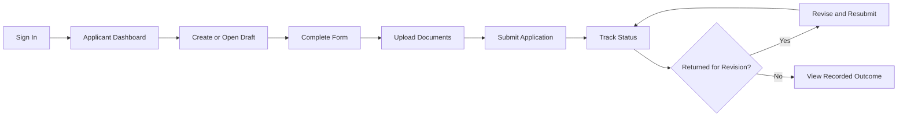
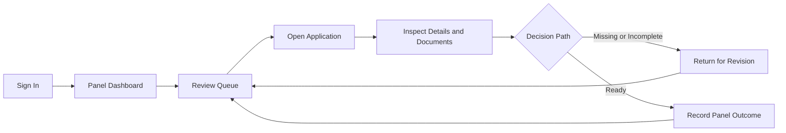

# FSMES Design Specs and AI Prompt Pack

This document is the design specification companion to `thesis/prd.md`. It is written to support a spec-driven design workflow and to serve as reusable source material for AI-assisted UI generation, wireframing, prototyping, and frontend implementation planning.

## 1. Product Context
### Product Name
Faculty Scholarship Grant Management and Evaluation System (FSMES)

### Product Type
Responsive internal web application for faculty scholarship application submission and Academic Scholarship Panel evaluation.

### Primary Users
- Faculty Applicant
- Academic Scholarship Panel Member

### Product Scope
FSMES covers only the application submission and panel evaluation stages of the IASP workflow under the APDP context at MSU-IIT.

### Scope Guardrails for Design Prompts
Do not generate screens or features for:
- Department Chairperson approval routing
- College Dean approval routing
- OVCAA workflow management
- Academic Planning Committee workflow
- Chancellor or Board of Regents approvals
- stipend, finance, or payroll modules
- post-award compliance tracking
- public scholarship marketplace pages
- in-app admin CMS unless explicitly requested later

## 4. Layout Rules
### Desktop Strategy
- Desktop-first for panel workflows.
- Left sidebar navigation for authenticated areas.
- Sticky top bar for page title, quick actions, and user menu.
- Content area should prioritize scannable cards, tables, and review panels.

### Mobile Strategy
- Collapse sidebar into a drawer.
- Prioritize stacked cards over wide tables.
- Keep primary actions visible without excessive scrolling.
- Ensure upload, review notes, and status visibility still work on smaller screens.

### Grid Guidance
- Use a 12-column layout on desktop.
- Use 1-column or 2-column collapse on mobile/tablet.
- Use wider content zones for review and document detail pages.

## 5. Information Architecture
### Shared Public Surface
- Sign In

### Applicant Navigation
- Dashboard
- My Applications
- New Application
- Application Details
- Profile

### Panel Navigation
- Dashboard
- Review Queue
- Application Review
- Decision Log or Completed Cases
- Profile

## 6. Shared UX Rules
- Every authenticated screen must clearly show the current user role.
- Every application-related screen must show current status above the fold.
- Every document-heavy screen must show both file label and file state.
- Revision requests must always show a clear reason, not just a status change.
- Dangerous or final actions must use confirmation patterns.
- The user should never lose orientation in the workflow.

## 7. Core Entities Designers Must Understand
- User
- User Profile
- Application
- Application Document
- Panel Review
- Decision Record
- Status History
- Activity Log

Designs should visually reinforce that the application is the central object, and everything else is attached to it.

## 8. Primary User Flows
### Applicant Flow

### Panel Flow

## 9. Screen Inventory
### 9.1 Sign In Screen
Purpose:
- Authenticate users and route them by role.

Must Include:
- concise explanation of system purpose
- email or username field
- password field
- sign-in CTA
- error state for failed authentication

Design Notes:
- Avoid a flashy marketing landing page style.

### 9.2 Applicant Dashboard
Purpose:
- Give the applicant immediate awareness of application state and next steps.

Must Include:
- current application status card
- quick action to start or continue an application
- recent activity or timeline
- checklist summary for required documents
- alerts for returned applications or missing items

Design Notes:
- Primary CTA should be obvious within 5 seconds.
- Emphasize status clarity over decorative metrics.

### 9.3 Application Form Screen
Purpose:
- Let an applicant create or edit a scholarship application.

Must Include:
- application metadata fields
- scholarship or program information fields
- institution or proposed study fields if applicable
- purpose statement area
- save draft action
- next section or submit action
- validation messages

Design Notes:
- Prefer sectioned form groups with strong labels.
- Use progressive disclosure only if it reduces overload without hiding required work.

### 9.4 Document Upload Screen or Section
Purpose:
- Let applicants upload and manage required supporting documents.

Must Include:
- list of required document slots
- upload control per document type
- file name, file state, upload timestamp
- replace or remove action while editable
- missing document warning

Design Notes:
- Make document completeness legible at a glance.
- Avoid generic file upload boxes with no context.

### 9.5 Application Detail and Status Screen
Purpose:
- Let applicants view submitted content, status, history, and revision instructions.

Must Include:
- status chip and summary banner
- submission details
- document list
- status timeline
- revision reason when applicable
- recorded panel outcome when available

Design Notes:
- Timeline and revision notes should feel authoritative and easy to scan.
- Use visual separation between applicant-submitted content and panel-side updates.

### 9.6 Panel Dashboard
Purpose:
- Help panel users see queue health and pending work.

Must Include:
- summary cards for submitted, under review, returned, and completed cases
- recent activity feed
- quick link to review queue
- warning section for overdue or unresolved cases if supported

Design Notes:
- Keep the dashboard operational, not executive-report styled.
- Use cards, small trend cues, and clean hierarchy.

### 9.7 Review Queue Screen
Purpose:
- Help panel users search, filter, and prioritize applications.

Must Include:
- searchable table or card list
- filters for status, date, applicant, and department if available
- sortable columns
- status chips
- row action to open review workspace

Design Notes:
- Queue should support fast scanning.

### 9.8 Panel Review Workspace
Purpose:
- Provide a focused workspace for evaluating one application.

Must Include:
- applicant identity block
- application details panel
- supporting document viewer or file list
- review notes panel
- missing items checklist or comments area
- action bar for returning for revision or recording outcome
- status history panel

Design Notes:
- This is the most important screen in the system.
- Use a split-pane or multi-column layout on desktop.
- Keep decision actions persistent and clearly separated from passive content.

### 9.9 Decision Recording Modal or Page
Purpose:
- Let the panel user record a panel-level outcome with confidence.

Must Include:
- application reference
- current status
- outcome selector
- notes field
- confirmation action
- cancel action

Design Notes:
- Use deliberate, high-clarity interactions.
- Make it impossible to confuse this with final APDP approval.

### 9.10 Shared Profile Screen
Purpose:
- Show role, account identity, and basic contact information.

Must Include:
- name
- role
- department or office
- email
- edit action for allowed fields

## 10. Shared Component Inventory
- primary button
- secondary button
- destructive button
- status chip
- summary card
- data table
- filter bar
- search field
- upload card
- file item row
- timeline item
- note card
- modal dialog
- empty state block
- loading skeleton
- inline validation message
- toast or banner feedback

## 11. Empty, Loading, and Error States
### Empty States
Include clear empty states for:
- no application yet
- no uploaded documents yet
- no review notes yet
- no queue results matching filter

### Loading States
Use:
- skeleton cards for dashboards
- skeleton rows for queue tables
- inline loaders for upload and save operations

### Error States
Every error message should:
- state what failed
- say what the user can do next
- avoid blame language

Example tone:
- `We could not upload this file. Please try again or choose a different file.`
- `This application could not be submitted because some required items are still missing.`

## 12. Interaction Rules
- Saving a draft should be quiet but visible.
- Final submission should require a deliberate confirmation.
- Returning an application for revision must require a reason.
- Recording a panel outcome must require explicit confirmation.
- Status changes must update the visible status timeline immediately.
- Applicants must not see other applicants' data.
- Panel users must never be able to accidentally edit applicant-owned submission fields directly.

## 14. Accessibility Requirements for Design Prompts
Every AI-generated design should explicitly include:
- visible focus states
- WCAG AA contrast
- text labels on icons
- status labels not dependent on color alone
- keyboard-friendly form flow
- large enough click targets for mobile

## 18. Handoff Notes for Frontend Developers
- Status chips and timeline components should come from one shared design source.
- Form validation patterns should be consistent between application fields and document requirements.
- Panel review actions should be kept in a reusable action bar pattern.
- Tables, cards, filters, and upload components should be designed as reusable primitives.

## 19. Final Reminder
Use `thesis/prd.md` as the source of truth for scope, roles, workflow rules, and requirements.

